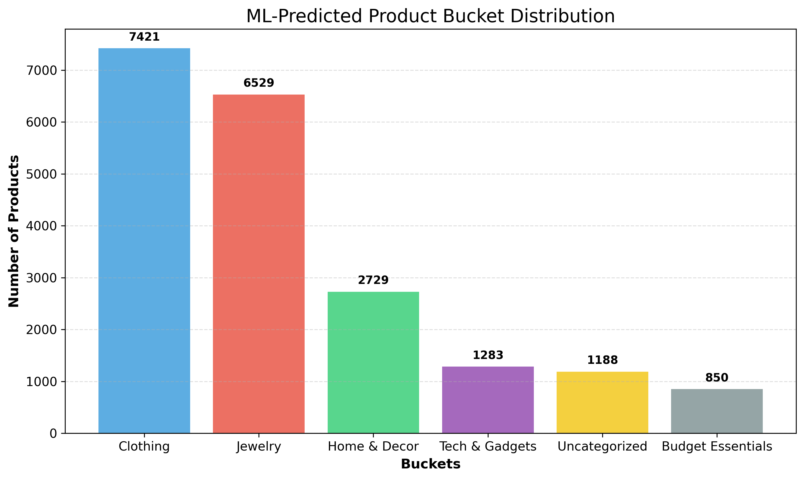

# 🛒 Flipkart Product Categorization

## 🧪 Diagnostic Script

**File:** `data_checker_script.py`

- Checks:
  - Missing values
  - Duplicates
  - Rating outliers
  - Price mismatches
  - Specification format
- Helpful for debugging raw or intermediate datasets

---

## 🧼 1. Data Cleaning

**File:** `cleaning.py`

- Replaces `"No rating available"` with NaN
- Converts numeric fields
- Standardizes text columns to lowercase
- Fills missing prices and brand info
- Saves cleaned output to:  
  ✅ `./data/flipkart_cleaned.csv`

---

## 🧠 2. Rule-Based Bucketing

**File:** `bucketing.py`

- Uses keyword sets to assign product buckets like:
  - `Clothing`, `Jewelry`, `Home & Decor`, `Tech & Gadgets`, `Budget Essentials`
- Applies two-step logic:
  1. Strict `confident_bucket` for clean training data
  2. Broader `final_bucket` labeling
- Saves outputs:
  - ✅ `./data/flipkart_labeled_seed.csv` (for training)
  - ✅ `./data/flipkart_buckets_single_label.csv`
  - 📊 Chart: `./figures/bucket_distribution.png`

---

## 🎓 3. Model Training

**File:** `training_model.py`

- Trains a `RandomForestClassifier` on `confident_bucket` examples
- Uses `TF-IDF` vectorizer over name + description + category
- Outputs:
  - ✅ Trained model: `./models/bucket_classifier.pkl`
  - ✅ Vectorizer: `./models/vectorizer.pkl`
  - 🧪 Evaluation: classification report printed in console

---

## 🚀 4. Prediction Using Trained Model

**File:** `predict_bucket.py`

- Loads cleaned data and applies the model
- Predicts bucket labels using trained classifier
- Saves results to:  
  ✅ `./data/predicted_buckets.csv`
- 📊 Saves prediction bar chart to:  
  📈 `./figures/predicted_bucket_chart.png`

---

## 📊 Sample Visualizations

### Final Bucket Distribution (Rule-based)

### Predicted Bucket Distribution (ML Model)

---

## ✨ Summary

This pipeline supports:
- 🔍 **Clean data transformation**
- 🧠 **Semi-supervised labeling using heuristics**
- 🤖 **Supervised model training for scalable classification**
- 📊 **Insightful visualizations for distribution**

---

