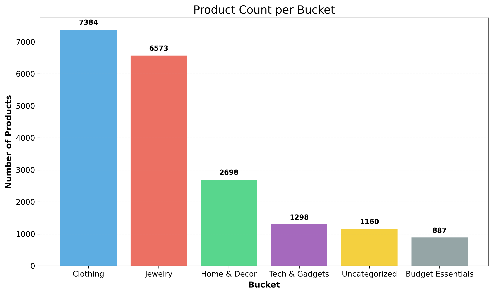

# 🛒 Flipkart Product Categorization

## 🔍 data_checker_script.py

- Shows shape, missing values, data types
- Detects:
  - Duplicate products
  - Price inconsistencies
  - Invalid ratings
  - Outliers in price

Use it to verify data health before modeling.

---

## 🧼 cleaning.py

- Replaces "No rating available" with NaN
- Converts rating fields to numeric
- Fills missing brand names
- Lowercases text fields
- Handles missing price data

➡️ Saves: `flipkart_cleaned.csv`

---

## 🧠 bucketing.py

- Adds `discount_percent`
- Buckets into:
  - Clothing
  - Jewelry
  - Tech & Gadgets
  - Home & Decor
  - Budget Essentials
  - Uncategorized
- Uses keywords, categories, and price
- Visualizes bucket counts

➡️ Saves:
- `flipkart_labeled_seed.csv` (confident labels)
- `flipkart_buckets_single_label.csv` (full labels)
- `bucket_distribution.png` (bar chart)

---

## 📊 Sample Bucket Distribution

---
