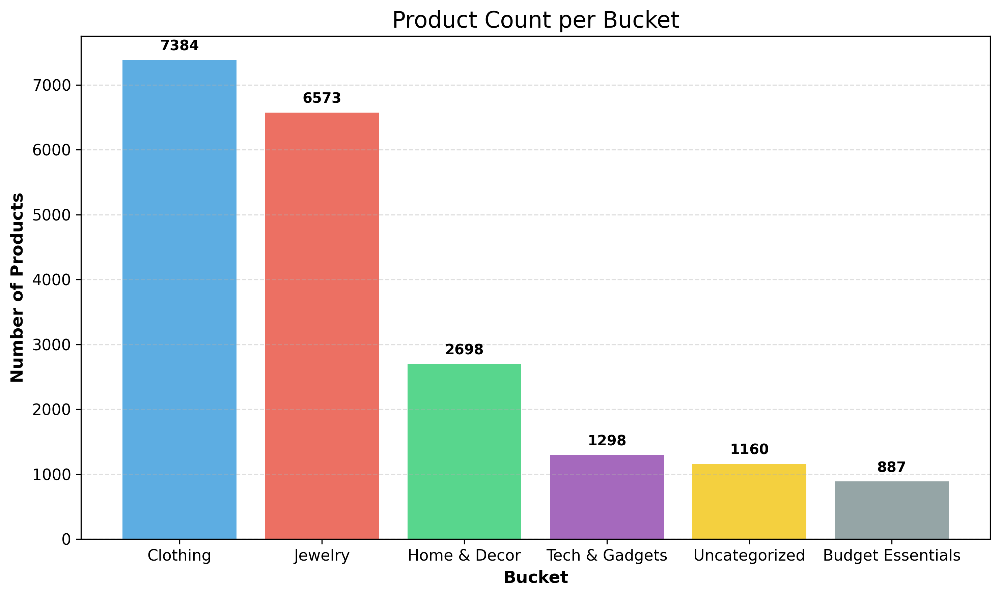
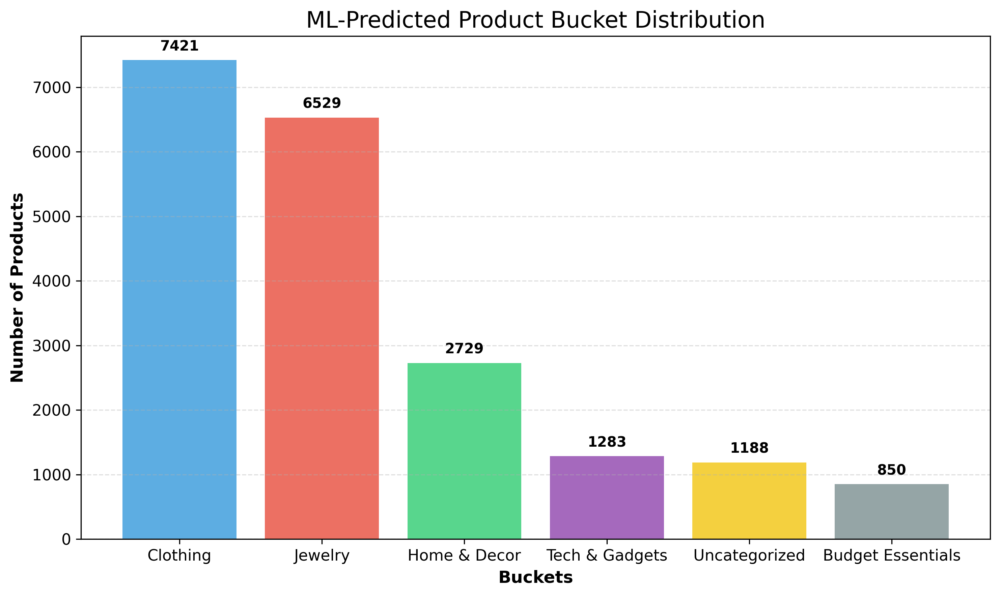
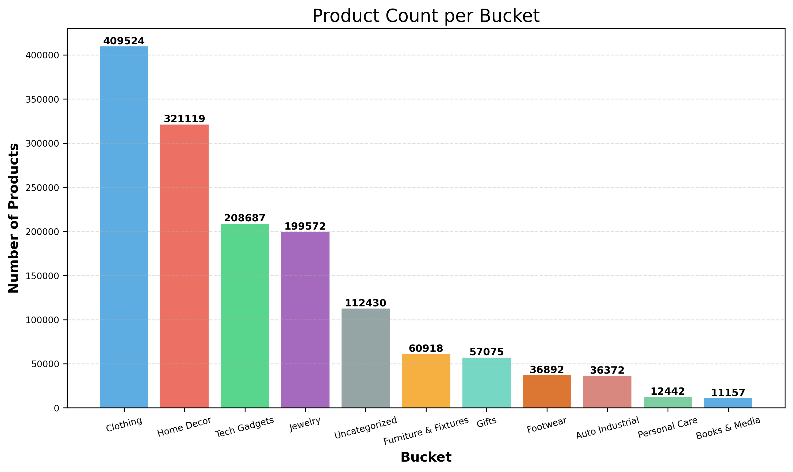
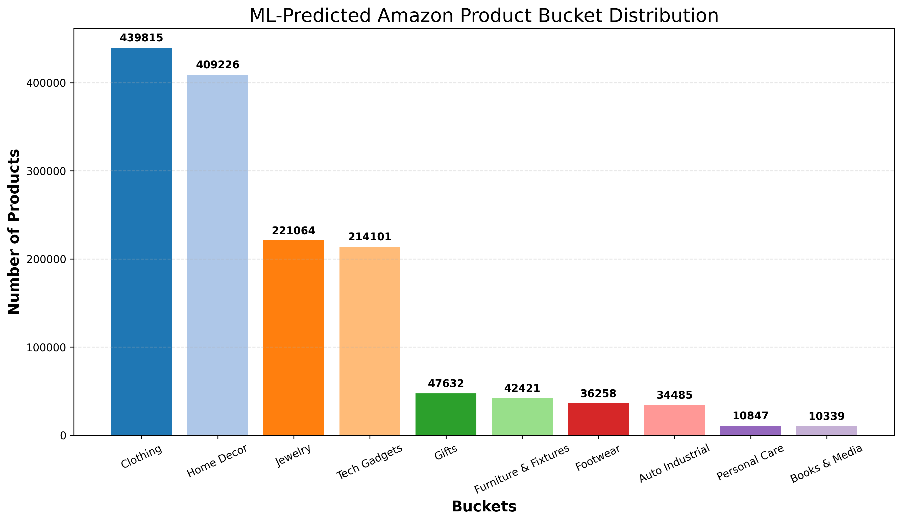

# 🛒 Flipkart Product Categorization

## 🧪 Diagnostic Script

**File:** `data_checker_script.py`

- Checks:
  - Missing values
  - Duplicates
  - Rating outliers
  - Price mismatches
  - Specification format
- Helpful for debugging raw or intermediate datasets

---

## 🧼 1. Data Cleaning

**File:** `cleaning.py`

- Replaces `"No rating available"` with NaN
- Converts numeric fields
- Standardizes text columns to lowercase
- Fills missing prices and brand info
- Saves cleaned output to:  
  ✅ `./data/flipkart_cleaned.csv`

---

## 🧠 2. Rule-Based Bucketing

**File:** `bucketing.py`

- Uses keyword sets to assign product buckets like:
  - `Clothing`, `Jewelry`, `Home & Decor`, `Tech & Gadgets`, `Budget Essentials`
- Applies two-step logic:
  1. Strict `confident_bucket` for clean training data
  2. Broader `final_bucket` labeling
- Saves outputs:
  - ✅ `./data/flipkart_labeled_seed.csv` (for training)
  - ✅ `./data/flipkart_buckets_single_label.csv`
  - 📊 Chart: `./figures/bucket_distribution.png`

---

## 🎓 3. Model Training

**File:** `training_model.py`

- Trains a `RandomForestClassifier` on `confident_bucket` examples
- Uses `TF-IDF` vectorizer over name + description + category
- Outputs:
  - ✅ Trained model: `./models/bucket_classifier.pkl`
  - ✅ Vectorizer: `./models/vectorizer.pkl`
  - 🧪 Evaluation: classification report printed in console

---

## 🚀 4. Prediction Using Trained Model

**File:** `predict_bucket.py`

- Loads cleaned data and applies the model
- Predicts bucket labels using trained classifier
- Saves results to:  
  ✅ `./data/predicted_buckets.csv`
- 📊 Saves prediction bar chart to:  
  📈 `./figures/predicted_bucket_chart.png`

---

## 📊 Sample Visualizations

### Final Bucket Distribution (Rule-based)

### Predicted Bucket Distribution (ML Model)

---

## 🛒 Amazon Product Categorization

Amazon's product dataset (2.2M+ rows) was categorized into 11 `semantic buckets`. This was done in two phases:

---

### 📁 Note on Data File

> ⚠️ The original `train.csv` file (~1.45 GB) is **not included in this repository** due to its size.  
> You will need to manually place `train.csv` inside the `data/amazon/` directory.  
> Once done, run: `cleaning.py`
> Then execute: `bucketing.py`
> You will be able to generate the same visualizations as shown below.

---

### 🧠 Buckets Used

- Clothing  
- Jewelry  
- Tech & Gadgets  
- Home & Decor  
- Furniture & Fixtures  
- Footwear  
- Auto & Industrial  
- Books & Media  
- Beauty & Personal Care  
- Gifts & Collectibles  
- Uncategorized (used only during rule-based phase)

---

1. 🔍 **Rule-based Labeling**  
   Keyword heuristics were applied to `TITLE`, `DESCRIPTION`, and `BULLET_POINTS` to assign initial labels.

   

2. 🤖 **ML-based Classification**  
   A supervised learning model (`Logistic Regression` with `TF-IDF` features) was trained on the labeled data to generalize predictions across the full dataset.

### 📊 Final Bucket Counts (Predicted by Model)

> ✅ No items were labeled as "Uncategorized" by the ML model.

---

## ✨ Summary

This pipeline supports:

- 🧹 **Clean data transformation**
- 🧠 **Semi-supervised labeling using heuristics**
- 🤖 **Supervised model training (TF-IDF + Logistic Regression)**
- 📈 **Efficient batch prediction & progress tracking**
- 📊 **Insightful visualizations of final distribution**

---
